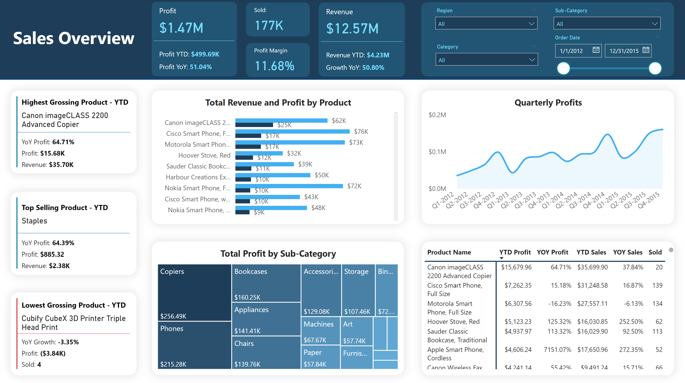
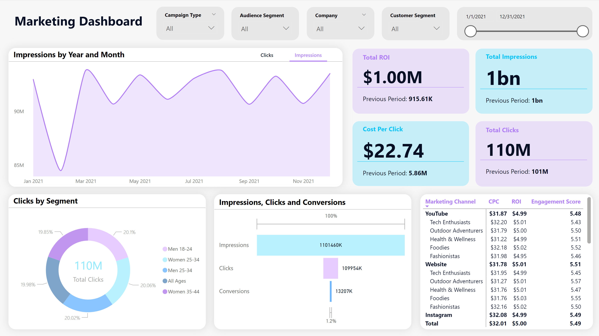
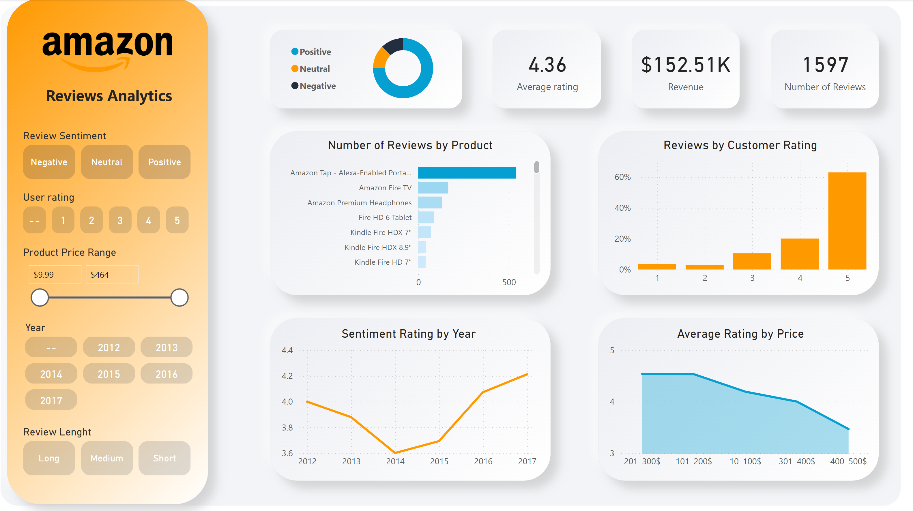

# Data Visualisation Dashboards

## Product Performance Report 

This Dashboard presents granular insights into product-level performance for an e-commerce buisness, showing which products drive profitability, contribute to revenue growth, and align with sales objectives. The main goals are helping with invenotry managment, strategic planing and product offering optimizations.

  

Answering questions:
- Top-Performing Products
  - Which products generate the highest revenue and profit?
  - What are the YoY growth rates for sales and profit of these products?
  - How many units of top-performing products are sold?
- Underperforming Products
  - Which products are contributing the least to revenue and profit?
  - What is the sales trend for low-performing products, and should they be re-evaluated?
- Sales Trends and Seasonal Patterns
  - How do profits and sales trends vary over time?
  - Are there patterns that suggest seasonality or high-demand periods for certain products?
- Regional and Product Category Breakdown
  - How does product performance vary across regions or categories?
  - Are there regional markets with high potential for specific products?
 
## Digital Marketing

Interactive Digital Marketing dashboard which provides a data-driven overview of marketing campaigns performance, focusing on key metrics like ROI, reach, engagement, and audience segmentation. Designed to support strategic planning and real-time optimization, it offers detailed insights into campaign efficiency, channel performance, temporal trends, and audience behavior.

  
  
Aiming to answer questions:

- Campaign Effectiveness
  -	Which marketing channels drive the highest impressions, clicks, and conversions?
  -	What is the ROI for each marketing channel?
  -	Are there any campaigns underperforming in terms of cost per click (CPC) or engagement score?
    
- Audience Segmentation
  - Which audience segments (e.g., age groups or gender) generate the most clicks and conversions?
  - Are there segments with low engagement that require tailored strategies?
  - How is performance distributed across audience segments, and are there growth opportunities?

- Cost and Revenue Analysis
  - What is the cost per click (CPC), and how does it compare to the previous period?
  - What is the total ROI, and which channels or campaigns are contributing the most to profitability?
  - Are there opportunities to reduce CPC or improve ROI across campaigns?
  
- Performance Trends
  - How do impressions, clicks, and conversions trend over time?
  - Are there seasonal patterns influencing campaign performance?
  - Are there specific months with higher engagement that can guide future campaign planning?

## Amazon Reviews Analytics

This project analyzes a dataset of 1,597 Amazon customer reviews, representing $152.51K in revenue. Sentiment analysis, powered by NLP, was performed on the text reviews to categorize feedback into positive, neutral, and negative sentiments. The dashboard provides an interactive interface for exploring trends in customer reviews and pricing, helping to uncover factors correlating with review sentiments.

  

Answering questions:
- How do review counts compare across different products?
- What is the overall distribution of review sentiments (positive, neutral, negative)?
- Are there significant shifts in sentiment over time?
- Do most products receive favorable feedback, or is there a substantial volume of negative ratings?
- Do higher-priced products correlate with better or worse average ratings?
- Do review lengths correlate with positive or negative sentiments?
